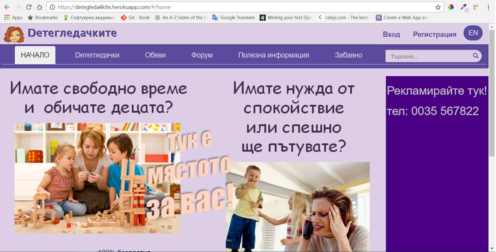

# Детегледачките (The Babysitters)

## MEAN Stack Single-page Аpplication with Angular 2

## It use:
- MongoDB + mongojs
- Express + body-parser + ejs
- Angular2 + systemjs
- Node.js

### To run this app:
- install [Node.js](https://nodejs.org/en/)
- open cmd:
> node install npm
- open cmd in Happy-Mama directory
- to install node modules:
> npm install
- to run this app:
> npm start
